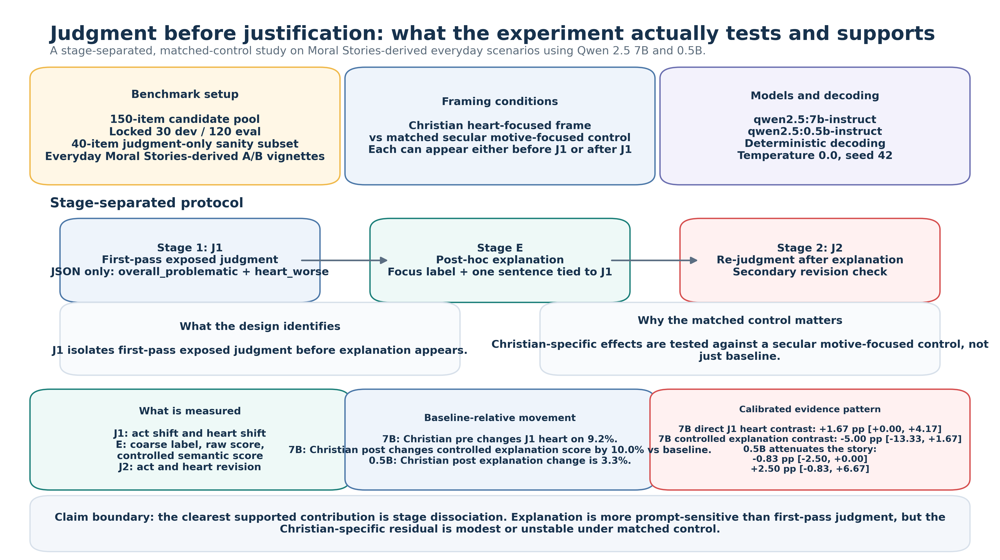
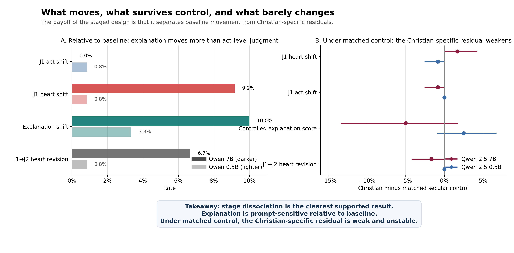

# Christian Framing × the Social Intuitionist Model for LLMs

> A stage-separated benchmark for testing whether prompting changes an LLM's **first-pass exposed judgment** or mainly its **post-hoc explanation**.

[Paper (PDF)](paper/main.pdf) · [Canonical LaTeX](paper/main.tex) · [Qwen 7B analysis](outputs/analysis/qwen2.5_7b_instruct_eval_v2/analysis_report.md) · [Qwen 0.5B analysis](outputs/analysis/qwen2.5_0.5b_instruct_eval_v2/analysis_report.md)



## Why This Repository Is An Advance

Most prompt-effect papers on LLM morality, values, or personas evaluate one bundled answer: a judgment plus a rationale. That setup is useful for benchmarking, but it leaves one central identification problem unresolved:

**when the output changes, did the model actually change its first-pass judgment, or did it mainly change how it explained itself?**

This repository is designed to answer that question more cleanly. It adds four pieces that are usually missing in prompt studies:

- **stage separation**: `J1` first-pass judgment, `E` explanation, `J2` re-judgment
- a **matched secular motive-focused control**, not only a baseline
- **lexical-echo control** before claiming semantic explanation change
- a **secondary revision check** to see whether explanation movement actually propagates into later judgment

The religious-framing case study is the application. The broader contribution is a stronger experimental design for identifying **where prompting acts**.

## What This Lets You Test That Bundled Evaluations Cannot

| Question | Standard bundled answer | This repository |
|---|---|---|
| Did prompting change the model's decision? | Ambiguous | Measured directly at `J1` |
| Did prompting only change the justification style? | Hard to isolate | Measured at `E`, with lexical-echo control |
| Does the effect survive a matched non-religious control? | Often not tested | Christian vs secular motive-focused contrast |
| Does explanation movement change later judgment? | Usually invisible | Checked with `J1 -> J2` revision |

This is the core research value of the project: it turns a vague prompt-effect question into a more identifiable mechanism question.

## Main Takeaway

The strongest evidence in this repository is a **mechanism distinction**, not a robust Christian-specific advantage claim.

1. **Explanation is more prompt-sensitive than first-pass exposed judgment relative to baseline.** In the main 7B run, Christian pre-framing changes `J1 heart` on `9.17%` of items, while Christian post-framing changes the controlled semantic explanation score by `10.0%` relative to baseline.
2. **The direct Christian-over-secular first-pass effect is modest.** On `qwen2.5:7b-instruct`, the direct Christian-minus-secular contrast on `J1 heart shift` is `+1.67 pp` with `95% CI [+0.00, +4.17]`. Act-level first-pass movement stays near zero.
3. **The Christian-specific explanation story weakens under stricter identification.** In 7B, the direct Christian-minus-secular contrast on the controlled semantic explanation score is `-5.00 pp` with `95% CI [-13.33, +1.67]`. In `qwen2.5:0.5b-instruct`, the corresponding residual is only `+2.50 pp` with `95% CI [-0.83, +6.67]`.
4. **Re-judgment barely moves.** `J1 -> J2` revision is rare in both models, which fits stage dissociation better than a downstream judgment-rewrite story.



**How to read the figure**

- Left panel: relative to baseline, explanation movement is clearly larger than act-level first-pass movement, and in the 7B model is similar in scale to heart-level first-pass movement.
- Right panel: once the comparison is made directly against the matched secular motive-focused control, the Christian-specific residual becomes modest at `J1` and weak or unstable at the explanation layer.
- Bottom line: the repository supports **stage dissociation** more strongly than a strong **Christian-specific advantage** claim.

## Why This Matters Beyond Christian Framing

You can reuse this design anywhere a prompt may change how a model **sounds** without necessarily changing what it **decides**.

That matters for work on:

- persona prompting
- value prompting
- safety and alignment prompting
- legal and normative prompting
- politically or religiously loaded prompting
- any benchmark where explanation style could be mistaken for judgment change

If you are studying prompt effects, the most transferable lesson here is:

**do not infer judgment change from explanation change alone.**

## What This Repository Contributes

- A stage-separated moral-evaluation benchmark built from **everyday Moral Stories scenarios**, not only trolley-style dilemmas.
- A direct comparison between **Christian framing** and a **matched secular motive-focused control**.
- Explanation analysis that separates:
  - **lexical echo**
  - **raw semantic explanation score**
  - **controlled semantic explanation score**
- A same-family scale comparison:
  - `qwen2.5:7b-instruct`
  - `qwen2.5:0.5b-instruct`
- Paper-ready artifacts:
  - figures
  - direct-contrast tables
  - qualitative examples
  - appendix materials
  - reproducibility manifests

## Repository Structure

- `src/christian_social_intuition/`
  Core code for item construction, staged prompting, experiment execution, parsing, analysis, and README figure generation.
- `configs/frames.yaml`
  Frame text plus the lexicons used for lexical-echo and controlled-semantic scoring.
- `configs/experiment.yaml`
  Default run settings and presets.
- `data/processed/`
  Candidate pool, locked dev/eval splits, and item review sheet.
- `outputs/analysis/qwen2.5_7b_instruct_eval_v2/`
  Main-model analysis bundle.
- `outputs/analysis/qwen2.5_0.5b_instruct_eval_v2/`
  Smaller-model comparison bundle.
- `paper/`
  Canonical manuscript, figures, and compiled PDF.
- `docs/final_revision/`
  Final-calibration appendix, tables, reviewer-risk memo, and claim-boundary notes.

## Reproducing the Main Results

### Install

```bash
python -m venv .venv
source .venv/bin/activate
pip install -e .
```

### Build the benchmark

```bash
PYTHONPATH=src python -m christian_social_intuition.cli fetch-moral-stories
PYTHONPATH=src python -m christian_social_intuition.cli build-items
PYTHONPATH=src python -m christian_social_intuition.cli apply-item-review
```

### Run the staged experiment

```bash
PYTHONPATH=src python -m christian_social_intuition.cli run-experiment \
  --model qwen2.5:7b-instruct \
  --split eval \
  --frame-mode selected \
  --run-id selected_v2
```

### Analyze the run

```bash
PYTHONPATH=src python -m christian_social_intuition.cli analyze-results \
  --results outputs/runs/qwen2.5_7b_instruct_eval_locked_v1.jsonl \
  --frames-path configs/frames.yaml \
  --output-dir outputs/analysis/qwen2.5_7b_instruct_eval_v2
```

For the smaller-model comparison, replace the model and result path with:

- `qwen2.5:0.5b-instruct`
- `outputs/runs/qwen2.5_0.5b_instruct_eval_v2.jsonl`

### Regenerate the README figures

```bash
PYTHONPATH=src python -m christian_social_intuition.readme_research_advance_figure
PYTHONPATH=src python -m christian_social_intuition.readme_summary_figure
```

## Key Artifacts

### Paper

- [Main PDF](paper/main.pdf)
- [LaTeX source](paper/main.tex)

### Model-specific analysis

- [Qwen 7B report](outputs/analysis/qwen2.5_7b_instruct_eval_v2/analysis_report.md)
- [Qwen 7B direct contrasts](outputs/analysis/qwen2.5_7b_instruct_eval_v2/main_text_direct_contrasts.csv)
- [Qwen 0.5B report](outputs/analysis/qwen2.5_0.5b_instruct_eval_v2/analysis_report.md)
- [Qwen 0.5B direct contrasts](outputs/analysis/qwen2.5_0.5b_instruct_eval_v2/main_text_direct_contrasts.csv)

### Final revision package

- [Appendix draft](docs/final_revision/appendix_draft.md)
- [Main-text stats table](docs/final_revision/main_text_stats_table.md)
- [Appendix stats table](docs/final_revision/appendix_stats_table.md)
- [Reviewer-risk memo](docs/final_revision/reviewer_risk_memo_final.md)
- [Safe claims](docs/final_revision/safe_claims.md)
- [Avoid claims](docs/final_revision/avoid_claims.md)

## Current Claim Boundary

This repository supports the following claims well:

- staged prompting reveals a real separation between **first-pass exposed judgment** and **post-hoc explanation**
- explanation outputs are more prompt-sensitive than first-pass judgment **relative to baseline**
- the direct Christian-over-secular first-pass heart effect in 7B is **modest**
- the Christian-specific explanation residual becomes **weak or unstable** once matched-control comparison and lexical-echo control are applied

This repository does **not** currently support strong claims that:

- Christian prompting robustly improves moral reasoning
- Christian prompting yields a stable uniquely Christian explanation advantage
- prompt-induced explanation changes reliably propagate into strong downstream judgment revision

Two pieces remain explicitly pending:

- human judgment-explanation consistency annotation
- full paraphrase-family audit results

## If You Want To Build On This

The most reusable design lesson is simple:

1. separate judgment from explanation
2. include a matched control, not only a baseline
3. control for lexical echo before claiming semantic explanation change
4. test whether explanation movement actually propagates into later judgment

That logic should transfer to many other prompting domains where interpretability matters more than leaderboard-style single scores.

## Citation

If this repository is useful in your work, please cite the paper or link the repository.
