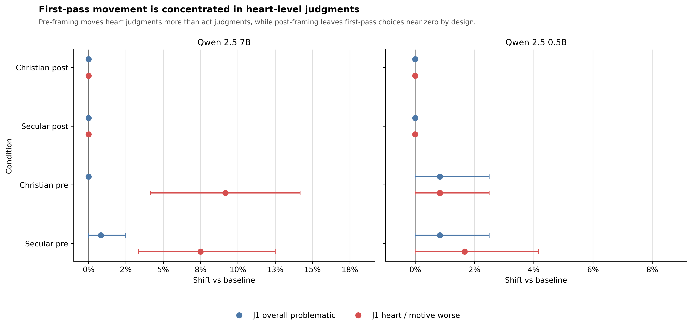
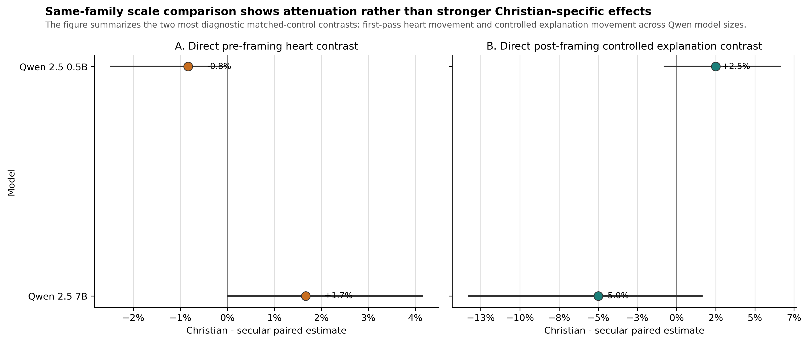

# Christian Framing × the Social Intuitionist Model for LLMs

This repository asks a narrower and more useful question than most moral-prompting papers:

**When a moral frame changes an LLM's output, does it change the model's first-pass exposed judgment, or mostly the explanation it gives afterward?**

To answer that, the project turns everyday **Moral Stories** scenarios into staged moral evaluations with three explicit steps:

- `J1`: first-pass forced-choice judgment
- `E`: post-hoc explanation tied to `J1`
- `J2`: re-judgment after explanation

The result is a mechanism-oriented benchmark for testing whether prompt effects are really judgment effects, explanation effects, or both.



## Why This Repo Exists

Most prompt-effect studies in LLM morality treat judgment and explanation as a single bundled response. That makes strong claims easy to overstate.

This project is designed to make that mistake harder.

It gives you a reproducible way to:

- separate **first-pass exposed judgment** from **post-hoc explanation**
- compare a **Christian heart-focused frame** against a **matched secular motive-focused control**
- test whether explanation movement survives **lexical-echo control**
- inspect whether explanation changes actually propagate into `J2`

If you care about prompt interpretability, value framing, or benchmark design, this is the practical use case:
**do not assume that a changed explanation means a changed judgment.**

## Main Takeaway

The current evidence supports a cleaner claim than the early version of the project did:

- **Explanation language is more prompt-sensitive than first-pass exposed judgment relative to baseline.**
- On `qwen2.5:7b-instruct`, the direct Christian-over-secular first-pass heart contrast is **modest**: `+1.67` percentage points (`95% CI: [+0.00, +4.17]`).
- First-pass act-level movement stays near zero.
- Once the comparison is made against a **matched secular motive-focused control** and explanation text is evaluated with **lexical-echo control**, the Christian-specific explanation advantage weakens or disappears.
- The smaller same-family model, `qwen2.5:0.5b-instruct`, **attenuates rather than strengthens** the Christian-specific story.
- `J1 -> J2` revision is rare, which supports a **stage dissociation** reading more than a downstream judgment-rewrite story.

### Compact Result Snapshot

| Contrast | `qwen2.5:7b-instruct` | `qwen2.5:0.5b-instruct` | Interpretation |
| --- | --- | --- | --- |
| `christian_pre - secular_pre` on `J1 heart shift` | `+1.67 pp` `[-0.00, +4.17]` | `-0.83 pp` `[-2.50, +0.00]` | Modest at 7B, absent at 0.5B |
| `christian_pre - secular_pre` on `J1 act shift` | `-0.83 pp` `[-2.50, +0.00]` | `+0.00 pp` `[+0.00, +0.00]` | Act movement stays near zero |
| `christian_post - secular_post` on raw explanation score | `-1.67 pp` `[-15.83, +11.67]` | `-4.17 pp` `[-20.83, +10.00]` | No stable Christian-specific raw explanation gain |
| `christian_post - secular_post` on controlled semantic explanation score | `-5.00 pp` `[-13.33, +1.67]` | `+2.50 pp` `[-0.83, +6.67]` | Weak, unstable after lexical control |
| `christian_post - secular_post` on `J1 -> J2 heart revision` | `-1.67 pp` `[-4.17, +0.00]` | `+0.00 pp` `[+0.00, +0.00]` | Post-framing does not create strong revision pressure |

Full paper-facing tables live in:

- [`outputs/analysis/final_combined_v2/main_text_direct_contrasts.csv`](outputs/analysis/final_combined_v2/main_text_direct_contrasts.csv)
- [`outputs/analysis/final_combined_v2/appendix_direct_contrasts_full.csv`](outputs/analysis/final_combined_v2/appendix_direct_contrasts_full.csv)



## What This Project Contributes

This repo is most useful as a research instrument, not just a paper artifact.

It gives you:

- a staged moral-evaluation pipeline anchored to **everyday scenarios**, not trolley-style edge cases
- a direct test of **generic motive salience** versus **Christian-specific framing**
- an explanation analysis that distinguishes **lexical echo** from a **controlled semantic explanation score**
- a same-family scale comparison inside Qwen, which is easier to interpret than an architecture-mixing robustness section
- paper-ready figures, tables, appendix materials, and reproducibility manifests

## Repository Tour

- `src/christian_social_intuition/`
  Core code for data building, staged prompting, experiment execution, parsing, and analysis.
- `configs/frames.yaml`
  Selected Christian and secular frame variants, plus lexicons for lexical echo and controlled semantic scoring.
- `configs/experiment.yaml`
  Default experiment settings and run presets.
- `data/`
  Source download location plus processed item pools, review sheets, and locked splits.
- `outputs/runs/`
  Raw staged model responses and run manifests.
- `outputs/analysis/`
  Final tables, figures, qualitative examples, and paper-facing summaries.
- `paper/`
  Canonical LaTeX manuscript and compiled PDF.
- `docs/final_revision/`
  Final calibration materials: appendix draft, stats tables, reviewer-risk memo, safe claims, and avoid-claims notes.

## Quickstart

### 1. Install

```bash
python -m venv .venv
source .venv/bin/activate
pip install -e .
```

### 2. Build the item pool

```bash
PYTHONPATH=src python -m christian_social_intuition.cli fetch-moral-stories
PYTHONPATH=src python -m christian_social_intuition.cli build-items
PYTHONPATH=src python -m christian_social_intuition.cli apply-item-review
```

### 3. Run the staged experiment

```bash
PYTHONPATH=src python -m christian_social_intuition.cli run-experiment \
  --model qwen2.5:7b-instruct \
  --split eval \
  --frame-mode selected \
  --run-id selected_v2
```

### 4. Analyze the results

```bash
PYTHONPATH=src python -m christian_social_intuition.cli analyze-results \
  --results outputs/runs/qwen2.5_7b_instruct_eval_v2.jsonl \
  --results outputs/runs/qwen2.5_0.5b_instruct_eval_v2.jsonl \
  --frames-path configs/frames.yaml \
  --output-dir outputs/analysis/final_combined_v2
```

## Reproduce the Paper

### Main manuscript

- Canonical source: [`paper/main.tex`](paper/main.tex)
- Compiled PDF: [`paper/main.pdf`](paper/main.pdf)

### Final revision package

- Appendix draft: [`docs/final_revision/appendix_draft.md`](docs/final_revision/appendix_draft.md)
- Main-text stats table: [`docs/final_revision/main_text_stats_table.md`](docs/final_revision/main_text_stats_table.md)
- Appendix stats table: [`docs/final_revision/appendix_stats_table.md`](docs/final_revision/appendix_stats_table.md)
- Reviewer-risk memo: [`docs/final_revision/reviewer_risk_memo_final.md`](docs/final_revision/reviewer_risk_memo_final.md)

### Final combined analysis

- Readout: [`outputs/analysis/final_readout.md`](outputs/analysis/final_readout.md)
- Main-text contrasts: [`outputs/analysis/final_combined_v2/main_text_direct_contrasts.csv`](outputs/analysis/final_combined_v2/main_text_direct_contrasts.csv)
- Full appendix contrasts: [`outputs/analysis/final_combined_v2/appendix_direct_contrasts_full.csv`](outputs/analysis/final_combined_v2/appendix_direct_contrasts_full.csv)
- Qualitative examples: [`outputs/analysis/final_combined_v2/qualitative_examples.csv`](outputs/analysis/final_combined_v2/qualitative_examples.csv)
- Figure notes: [`outputs/analysis/final_combined_v2/figure_notes.md`](outputs/analysis/final_combined_v2/figure_notes.md)

## Experimental Defaults

- Candidate pool: `150` items
- Locked development split: `30` items
- Locked evaluation split: `120` items
- Sanity subset: `40` eval items for `judgment_only`
- Main model: `qwen2.5:7b-instruct`
- Smaller comparison model: `qwen2.5:0.5b-instruct`
- Deterministic decoding by default
- Two frame modes:
  - `selected`
  - `family_audit` (implemented, not yet complete as a reported result set)

## Output Schema

Each experiment row is normalized into a single JSON object with:

- `model`
- `split`
- `run_id`
- `condition`
- `item_id`
- `seed`
- `temperature`
- `max_judgment_tokens`
- `max_explanation_tokens`
- `frame_mode`
- `frame_family`
- `frame_variant_id`
- `frame_position`
- `frames_config_version`
- `j1_act`
- `j1_heart`
- `e_focus`
- `e_text`
- `j2_act`
- `j2_heart`
- `raw_trace`

## Current Claim Boundary

This repository does **not** support the strongest version of the original story.

What it supports well:

- stage dissociation between first-pass exposed judgment and post-hoc explanation
- modest Christian-over-secular first-pass heart movement at `7B`
- prompt-sensitive explanation behavior relative to baseline
- caution against reading bundled judgment+explanation outputs as if they reflected one stable mechanism

What it does **not** currently support strongly:

- a stable, uniquely Christian-specific explanation advantage under matched-control comparison
- strong downstream judgment rewriting from `J1` to `J2`
- broad claims about moral improvement

Two parts remain explicitly pending:

- human judgment-explanation consistency annotation
- full paraphrase-family audit results

## Why This May Be Useful Beyond This Paper

Even if you do not care about Christian framing specifically, the repo gives you a reusable pattern for any value- or persona-framing study:

- separate judgment from explanation
- include a matched control, not only a baseline
- control for lexical echo before claiming semantic explanation change
- test whether explanation movement actually propagates into later judgment

That design logic transfers cleanly to political, legal, safety, religious, and alignment-sensitive prompting studies.

## Status

- Canonical manuscript and PDF are complete.
- Final paper-facing analysis artifacts are committed.
- Same-family scale comparison is complete.
- Family-audit support exists in the codebase, but full family-audit results are not yet part of the final evidence base.

## Citation

If this project is useful in your work, please cite the paper or link this repository once the public GitHub URL is live.
